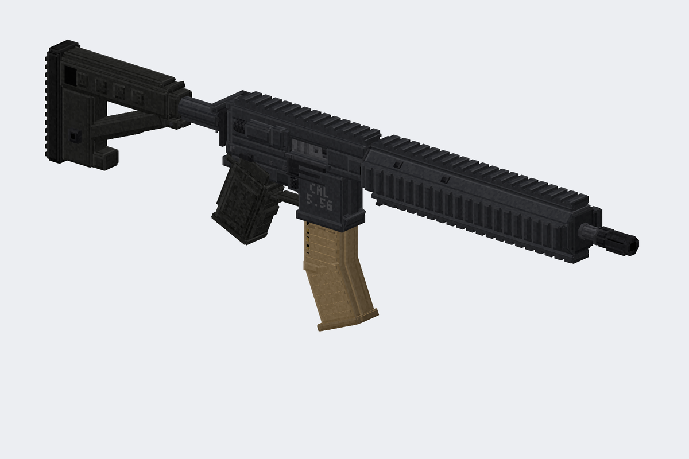
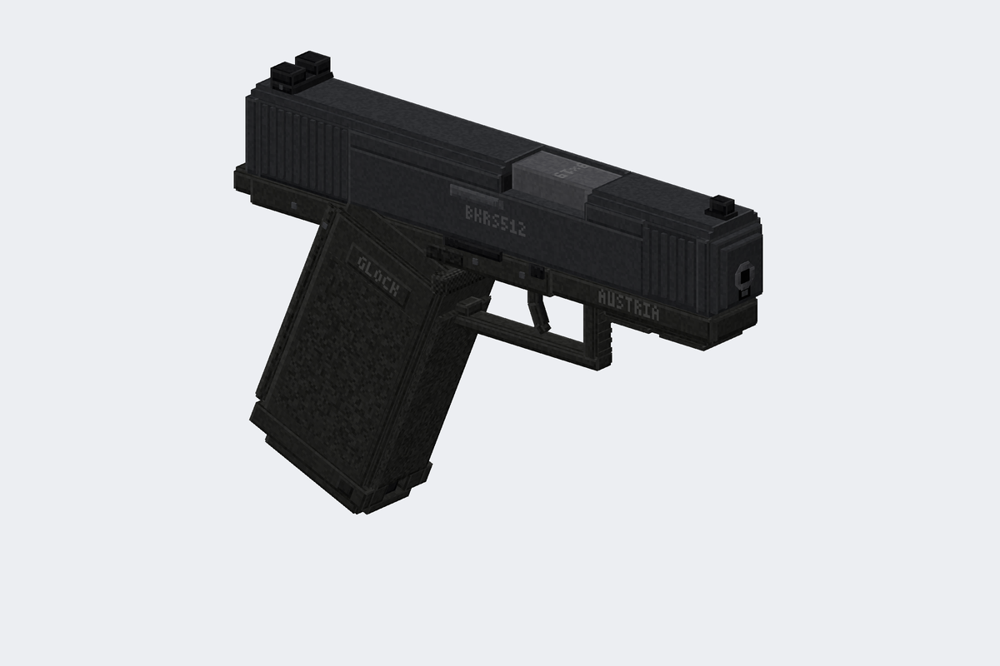
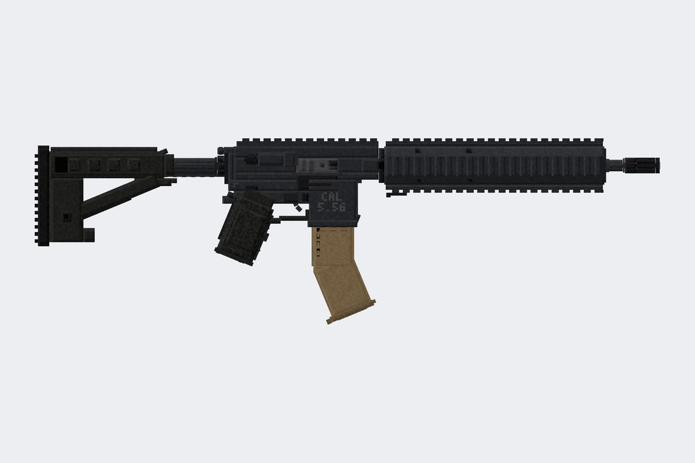
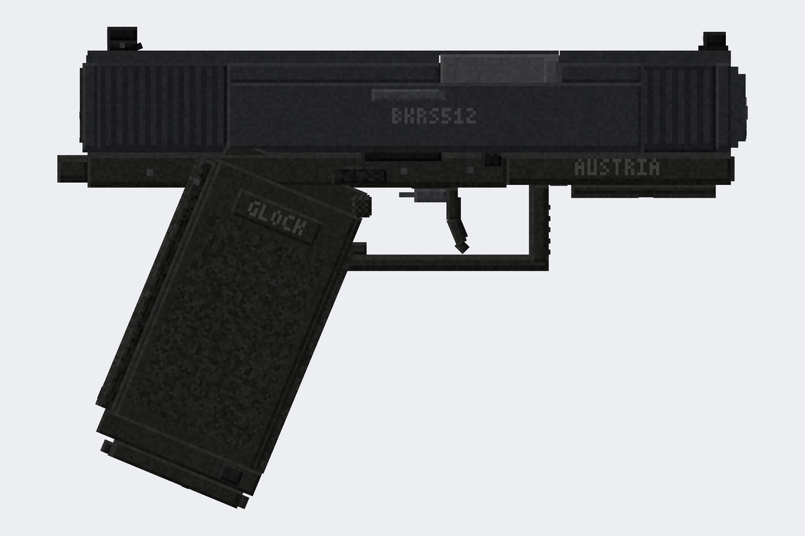

# modelsguns — MK18 и Glock 17 для Minecraft (Blockbench)

Детализированные 3D-модели оружия в формате **Blockbench → Java Block/Item**
и готовый ресурспак для Minecraft Java.

| MK18 Mod 1 | Glock 17 Gen 5 |
|---|---|
|  |  |
|  |  |

## Что внутри

```
blockbench/            проекты .bbmodel (открыть в Blockbench, текстура встроена)
  mk18.bbmodel
  glock17.bbmodel
resourcepack/          готовый ресурспак (модели .json + текстуры .png)
previews/              рендеры с разных сторон
tools/                 генератор моделей на Python (геометрия задаётся кодом)
```

Только само оружие: без коллиматоров, фонарей, рукояток и прочего обвеса.
Детали сделаны геометрией (зубцы планок, насечки, штифты, рёбра магазина),
а маркировка нанесена в текстуру. Полностью скрытые внутри грани не
текстурируются и не экспортируются.

### MK18 Mod 1 (CQBR) — 437 кубов, текстура 512×512
- **ствол:** пламегаситель «птичья клетка» со сквозными прорезями (видна
  внутренняя трубка), шайба, буртик;
- **цевьё RIS II:** четыре планки Picatinny с отдельными зубцами (около 100 штук),
  ласточкины хвосты под планками, упоры на концах, болты с гайками, торцевая
  крышка с антабкой, фиксатор цевья, гайка ствола с пазами под ключ;
- **верхний ресивер:**
  - открытое окно выброса, в котором видны затворная рама с насечками,
    затвор, экстрактор и ось;
  - откинутая крышка окна на оси с пружиной и проушинами;
  - отражатель гильз, досылатель с накаткой, рукоятка заряжания с рифлёной
    защёлкой;
  - планка Picatinny с зубцами;
- **нижний ресивер:**
  - шахта магазина с раструбом и рёбрами, маркировка «MK18 MOD 1 / 5.56»;
  - затворная задержка с рифлёными площадками;
  - кнопка магазина с ограждением;
  - двусторонний предохранитель с метками SAFE/SEMI;
  - изогнутый спуск из трёх сегментов, увеличенная спусковая скоба;
  - штифты с обеих сторон;
- **пистолетная рукоять:** стиплинг, боковые панели, выступ под палец,
  «бобровый хвост», крышка отсека;
- **приклад Magpul CTR:**
  - буферная трубка с гайкой и отверстиями фиксации позиций;
  - рычаги фиксатора, гнёзда QD, прорези под ремень;
  - каркас с распорками, рифлёный затыльник;
- **магазин PMAG:** рёбра, точечная фактура, окно с видимыми патронами,
  затыльник с выступами.

### Glock 17 Gen 5 — 163 куба, текстура 512×512
- **затвор:**
  - передние и задние насечки сделаны геометрией;
  - скошенный нос Gen 5 и ступенчатые фаски сверху;
  - окно выброса со стволом (маркировка «9x19») и казённым срезом;
  - экстрактор с индикатором патрона в патроннике;
  - задняя крышка с каналом ударника;
  - маркировка «GLOCK 17 GEN5 AUSTRIA 9x19» и серийный номер;
- **прицельные:** штатная мушка с белой точкой, целик с белой «U»-обводкой;
- **ствол:** дульный срез с каналом, направляющая возвратной пружины;
- **рамка:**
  - кожух с планкой и поперечным пазом, табличка с серийным номером;
  - площадки под большой палец;
  - спусковая скоба с насечками спереди и подрезом;
  - спуск из трёх сегментов с предохранителем, спусковая тяга;
  - три пары штифтов;
  - двусторонние задержка затвора и рычаг разборки с насечками;
  - кнопка магазина;
- **рукоять (22°):**
  - стиплинг, обрамление панелей, логотипы;
  - съёмный бэкстрап со штифтом, отверстие под темляк;
  - раструб шахты с вырезом Gen 5, в котором виден корпус магазина;
  - затыльник магазина.

Все модели укладываются в ограничения Java Edition (координаты −16…32,
повороты только по одной оси и кратные 22.5°), так что их можно
экспортировать из Blockbench без ошибок.

## Как открыть в Blockbench
`File → Open Model` → `blockbench/mk18.bbmodel` (или `glock17.bbmodel`).
Детали разложены по группам (`barrel`, `handguard`, `upper`, `lower`, `stock`,
`magazine`, `slide`, `frame`, `grip`, …), настройки отображения (рука, GUI, рамка, земля) уже
заполнены во вкладке **Display** — их можно подправить под свой вкус.

## Как использовать в игре (1.21.4+)
1. Скопируйте папку `resourcepack` в `.minecraft/resourcepacks/` (можно
   переименовать) и включите пак.
2. Выдайте предмет с нужной моделью:
   ```
   /give @s minecraft:stick[minecraft:item_model="modelsguns:mk18"]
   /give @s minecraft:stick[minecraft:item_model="modelsguns:glock17"]
   ```

Для версий до 1.21.4 используйте `custom_model_data` + `overrides` в модели
ванильного предмета, указав `"model": "modelsguns:item/mk18"`. Если игра пишет,
что пак «для другой версии», просто поменяйте `pack_format` в `pack.mcmeta`.

## Пересборка / изменение моделей
Геометрия описана в `tools/mk18.py` и `tools/glock17.py` (каждая деталь — одна
строка `B("имя", x0, y0, z0, x1, y1, z1, материал, группа, узор)`), текстура
рисуется процедурно. После правок:

```
pip install pillow numpy
python3 tools/build.py
```

Скрипт пересоздаст `.bbmodel`, ресурспак и превью.
