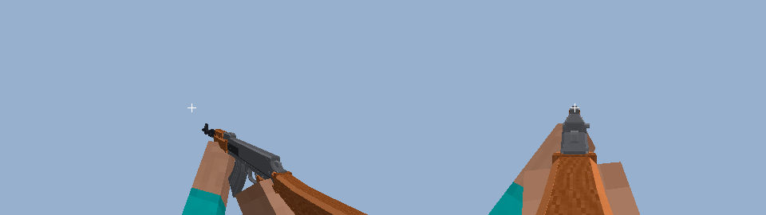

# modelsguns — модели оружия для мода на Fabric (GeckoLib)

Детализированные 3D-модели оружия для Minecraft **26.2 + Fabric + GeckoLib 5**:
геометрия Bedrock (`.geo.json`) с костями под анимации, анимации, текстуры и
определения предметов. Плюс проекты Blockbench для ручной доработки.


| Ствол | id | Подвижные кости |
|---|---|---|
| MK18 Mod 1 | `mk18` | bolt, charging_handle, trigger, dust_cover, magazine, bolt_catch, mag_release, selector |
| Glock 17 Gen 5 | `glock17` | slide, barrel, trigger, magazine, slide_stop, mag_catch |
| AK-47 | `ak47` | bolt, trigger, selector, top_cover, magazine |
| Desert Eagle .50 AE | `deagle` | slide, hammer, trigger, magazine |
| H&K MP5 (A2, как на фото) | `mp5a5` | cocking_handle, trigger, selector, magazine |
| Remington 870 Express | `m870` | pump, trigger, shell |
| AI AWM .338 | `awm` | bolt, trigger, magazine |

У всех ещё есть кости рук `right_arm` и `left_arm` (см. ниже).

Только само оружие: без прицелов, фонарей и прочего обвеса (у MK18 и AWM — только
планки). Все семь стволов построены по референсным фото: контур каждой детали
снят с фото в миллиметрах (силуэты — в `tools/silhouettes/`, сами фото в
репозиторий не входят), толщины — по реальным размерам. У фото MK18 сильная
перспектива, масштаб по длине скорректирован (`tools/mk18.py`, `scale()`); Glock
снят в ракурсе ¾, поэтому его профиль построен по заводским размерам, а детали
Gen5 (насечки, скос носа затвора, расширенная шахта с вырезом) — по фото. MP5
сделан как на фото — с постоянным прикладом (A2).

## Руки (как в Minecraft)

Руки — это руки игрока: каждая рука — куб 4×12×4 текселя (плюс внешний слой
рукава 0,25 текселя), UV ровно как у рук на скине 64×64. Поэтому мод рисует кости
`right_arm` / `left_arm` **скином самого игрока**: в примере `GunRenderer` вешает
на обе кости `CustomBoneTextureGeoLayer` со скином локального игрока. В текстуре
ствола левый верхний угол 64×64 занят руками «как у Стива» в той же раскладке —
это запасной вариант, если слой не подключён. Руки видны только от первого лица.

Размер рук одинаков на экране для всех стволов (тексель скина = 0,036 блока).
Правая рука держит рукоять, левая — цевьё (у пистолетов — снизу сбоку от правой).



## Анимации

Все анимации — `animation.<id>.<имя>`. Превью — честный перспективный рендер от
первого лица (FOV 70, белый крестик — центр экрана): `previews/anim/<id>_<имя>.gif`,
кадр «от бедра / в прицеле» — `previews/<id>_fp.png`.

| Что | Имя | Цикл |
|---|---|---|
| 1. Покой | `idle` | да |
| 2. Выстрел от бедра | `shoot` (`shoot_last` — последний патрон, затвор на задержке) | |
| 3. Выстрел в прицеле | `aim_in` → `aim` (держать) → `shoot_aim` → `aim_out` | `aim` |
| 4. Перезарядка | `reload`, `reload_empty`; у Remington `reload_start` → `reload` (на каждый патрон) → `reload_end` | |
| 5. Холостой спуск (пусто) | `dry_fire`, `dry_fire_aim` | |
| 6. Бег (оружие поджато) | `sprint` | да |
| Ходьба | `walk` | да |
| Прочее | `draw`, `holster`, `inspect`, `idle_empty`; `firemode` (MK18, AK), `pump` (870), `bolt` (AWM) | |

- **Положение от первого лица** задано в `models/item/<id>.json`
  (`firstperson_righthand`): рукоять в правой нижней части экрана, ствол слегка
  развёрнут, чтобы был виден его левый бок.
- **Прицеливание:** поза `aim` рассчитана из этого трансформа: поворот корня
  компенсирует разворот, линия прицеливания (целик, у MK18 и AWM — над планкой,
  как через оптику) встаёт точно в центр экрана; у длинных стволов глаз над
  прикладом в ~0,24 блока за рукоятью, у пистолетов целик в 0,52 блока от глаза.
  Если поменяете `display`, пересоберите (`python3 tools/build.py <id>`).
- **Руки в анимациях:** рука повторяет траекторию точки детали, с которой
  работает (с учётом её поворота): при перезарядке левая рука берёт магазин за
  дно, уносит и приносит новый; у MK18 и MP5 левая рука тянет рукоятку взведения
  (у MP5 — «HK slap»), у AK — затворную раму в `reload_empty`/`inspect`; у
  Remington левая рука ходит с цевьём и досылает патроны в окно; у AWM правая
  рука работает затвором. Несколько действий в одной анимации идут по очереди.
- Две кости-контроллера в примере: `state` (idle / walk / sprint / aim,
  выбирается на клиенте) и `action` (все одноразовые анимации через
  `triggerAnim`). Переходы между циклами сглаживаются (5 тиков).

## Что внутри

```
geckolib/assets/modelsguns/             -> скопировать в src/main/resources/assets/<modid>/
  geckolib/models/item/<id>.geo.json       геометрия (Bedrock 1.12.0), кости = группы
  geckolib/animations/item/<id>.animation.json
  textures/item/<id>.png
  models/item/<id>.json                    базовая модель: положение в руке / GUI / рамке
  items/<id>.json                          minecraft:special -> geckolib:geckolib
geckolib/example/                       пример кода (Fabric 26.2, Mojang-имена, GeckoLib 5)
blockbench/<id>.bbmodel                 проекты Blockbench (формат Bedrock Model, текстура встроена)
previews/                               рендеры с разных сторон, <id>_fp.png и anim/*.gif — от первого лица
tools/                                  генератор моделей на Python
```

## Подключение к моду

1. Подключите GeckoLib 5 для 26.2 (Fabric) как зависимость мода.
2. Скопируйте `geckolib/assets/modelsguns/*` в `src/main/resources/assets/<ваш_modid>/`.
   Файлы не ссылаются на namespace, кроме `items/*.json` и `models/item/*.json`
   (там `modelsguns:item/<id>`) — замените `modelsguns` на свой modid.
3. Зарегистрируйте предметы, как в `geckolib/example/`:
   - `GunItem` реализует `GeoItem`;
   - в `createGeoRenderer` отдаёт `GunRenderer` (наследник `GeoItemRenderer` с
     `DefaultedItemGeoModel`, который сам найдёт `geckolib/models/item/<id>.geo.json`,
     `geckolib/animations/item/<id>.animation.json` и `textures/item/<id>.png`);
     `GunRenderer` прячет руки вне первого лица и рисует их скином игрока;
   - предмет регистрируется с `Item.Properties().setId(key)`.
4. Анимации запускаются по имени `animation.<id>.<имя>`, например
   `triggerAnim(player, GeoItem.getOrAssignId(stack, serverLevel), "action", "shoot")`.

Пути, формат UV, порядок поворотов и знаки анимаций сверены с исходниками
GeckoLib (ветка `26.2`). В игре модели и пример кода не запускались — это шаблон.

## Стиль и технические детали

- Детали сложной формы (рамки, приклады, рукояти, магазины) — это контур с фото,
  выдавленный на толщину детали: заполнение изнутри плюс по ребру контура полоса
  с фасками под 45°, повёрнутая точно по ребру, поэтому наклонные и изогнутые
  края гладкие, без «лесенки».
- Фаски на длинных рёбрах с бликами, восьмигранные «цилиндры», ровная
  «нарисованная» текстура: шлифованная сталь, дерево, клетчатый стиплинг,
  насечка на дереве, маркировка.
- Полностью скрытые внутри грани не текстурируются; у подвижных деталей грани
  оставлены, чтобы их было видно во время анимации.
- Из-за поворотов по нескольким осям модели больше не подходят для ванильных
  Java-моделей предметов — только GeckoLib/Bedrock.

## Пересборка / новые стволы

```
pip install pillow numpy opencv-python scipy
python3 tools/build.py              # все стволы
python3 tools/build.py ak47         # только один
python3 tools/animpreview.py ak47   # GIF-превью анимаций
python3 tools/silhouette.py <папка с фото>   # заново снять силуэты (нужны фото)
```

Каждый ствол — файл `tools/<id>.py` с функцией `build()`, `GRIP_POINT`, `DISPLAY`,
`ARMS` (где руки держат оружие), `ANIM` / `ANIMATIONS`, плюс строка в
`GUN_MODULES` в `tools/build.py`. Детали задаются в миллиметрах через `MM`:
`k.prof(имя, контур, x0, x1, материал, кость)` — выдавленный контур,
`k.b` / `k.bv` — бруски (с фасками), `k.cyl` / `k.cylx` / `k.pin` — «цилиндры»,
`with k.frame("x", угол, x, y, z):` — наклонные детали.
