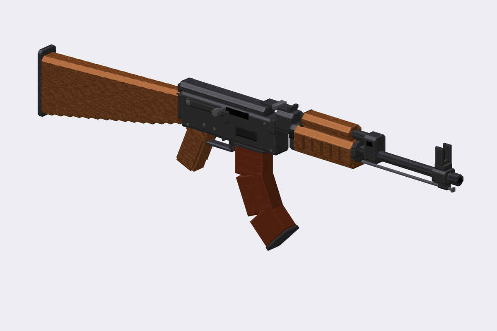
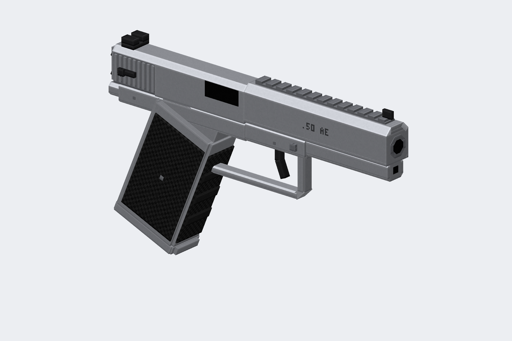
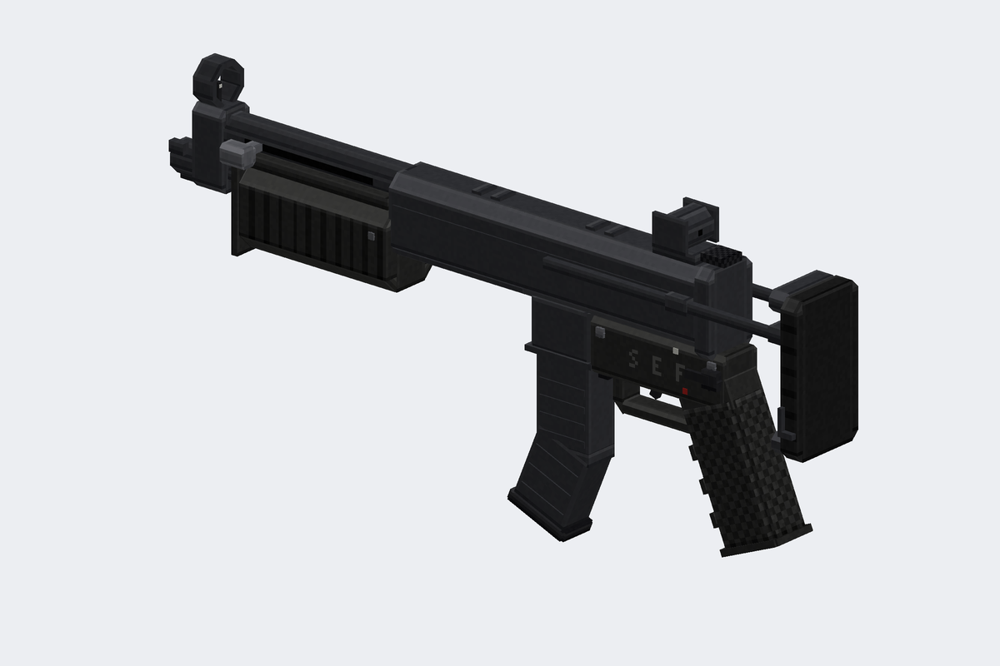
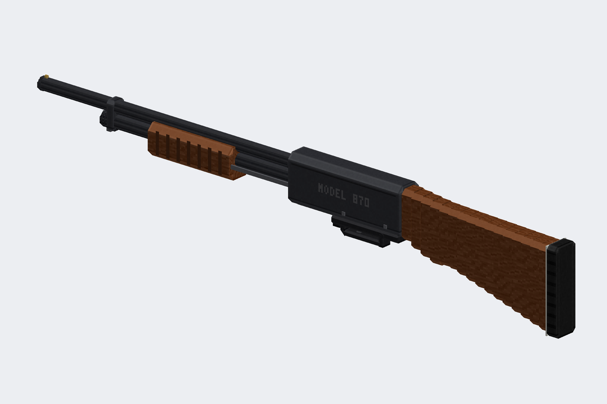
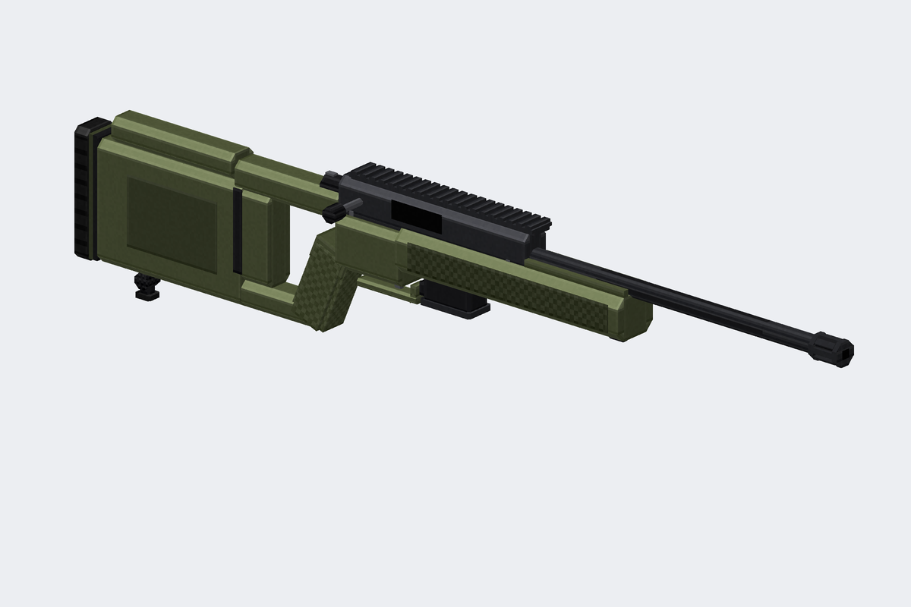

# modelsguns — модели оружия для Minecraft (Blockbench / GeckoLib)

Детализированные 3D-модели оружия для мода на Fabric. Каждый ствол выгружается сразу
в трёх видах:

- **GeckoLib** (`.geo.json` + анимации) — для своего мода на Fabric/Forge;
- **Blockbench** (`.bbmodel`) — чтобы открыть и доработать руками;
- **ванильная Java-модель** (ресурспак) — работает и без модов.

| | |
|---|---|
|  |  |
|  |  |
|  |  |
|  | |

| Ствол | id | Кубов | Кости (для анимаций) | Анимации |
|---|---|---|---|---|
| MK18 Mod 1 | `mk18` | 491 | bolt, charging_handle, trigger, dust_cover, magazine, … | shoot, reload |
| Glock 17 Gen 5 | `glock17` | 191 | slide, barrel, trigger, magazine, … | shoot, reload |
| AK-47 (фрезерованный, дерево) | `ak47` | 292 | bolt, trigger, magazine, … | shoot, reload |
| Desert Eagle .50 AE | `deagle` | 134 | slide, hammer, trigger, magazine, … | shoot, reload |
| H&K MP5A5 | `mp5a5` | 180 | cocking_handle, trigger, magazine, … | shoot, reload |
| Remington 870 | `m870` | 212 | pump, trigger, … | shoot, pump |
| AI AWM .338 | `awm` | 204 | bolt, trigger, magazine, … | shoot, bolt, reload |

Все текстуры 512×512. Только само оружие: без прицелов, фонарей и прочего обвеса
(у AWM — только планка под оптику).

## Что внутри

```
geckolib/assets/modelsguns/     всё для GeckoLib (копируется в src/main/resources/assets/modelsguns/)
  geo/item/<id>.geo.json          геометрия (Bedrock 1.12.0) с костями
  animations/item/<id>.animation.json
  textures/item/<id>.png
  models/item/<id>.json           parent builtin/entity + положение в руке/GUI
geckolib/example/               пример кода предмета на Fabric + GeckoLib 4
blockbench/<id>.bbmodel         проекты Blockbench (текстура встроена)
resourcepack/                   ванильный ресурспак (модели + текстуры)
previews/                       рендеры с разных сторон
tools/                          генератор моделей на Python
```

## Подключение к моду (Fabric + GeckoLib)

1. Добавьте GeckoLib в зависимости мода (версию берите под свою версию Minecraft
   на странице GeckoLib на Modrinth/CurseForge).
2. Скопируйте содержимое `geckolib/assets/modelsguns/` в
   `src/main/resources/assets/<ваш_modid>/`. Файлы не ссылаются на namespace,
   так что modid может быть любым.
3. Зарегистрируйте предметы, как в `geckolib/example/` (`GunItem` реализует
   `GeoItem`, рендер — `GeoItemRenderer` + `DefaultedItemGeoModel`, который сам
   найдёт `geo/item/<id>.geo.json`, `textures/item/<id>.png` и
   `animations/item/<id>.animation.json`).
4. Анимации запускаются по имени: `animation.<id>.shoot`, `animation.<id>.reload`,
   `animation.m870.pump`, `animation.awm.bolt`.

Пример написан под GeckoLib 4 для 1.20.1 (Yarn). В GeckoLib 4.5+ (1.21.x) пакеты
`software.bernie.geckolib.core.*` переехали в `software.bernie.geckolib.animation.*`
и т.п. — поправьте импорты под свою версию. Код примера не собирался в этом
репозитории, это шаблон.

Если какая-то модель в игре выглядит не так, как в Blockbench, можно открыть
`blockbench/<id>.bbmodel` и сделать `File → Convert Project → GeckoLib Animated Model`
(нужен плагин GeckoLib для Blockbench), а потом экспортировать `.geo.json` оттуда.

## Стиль

Как у современных паков оружия: настоящие фаски под 45° на длинных рёбрах с
бликами, восьмигранные «цилиндры», ровная «нарисованная» текстура с подсветкой
рёбер, клетчатый стиплинг, фактура дерева, маркировка в текстуре. Скрытые внутри
грани не текстурируются (кроме подвижных деталей — их видно во время анимации).
Геометрия держится в рамках ограничений Java (поворот по одной оси, шаг 22.5°),
поэтому те же модели работают и как ванильные предметы.

## Подробно про MK18 и Glock 17

### MK18 Mod 1 (CQBR) — 490 кубов, текстура 512×512
- **ствол:** пламегаситель «птичья клетка» со сквозными прорезями (видна
  внутренняя трубка), шайба, буртик;
- **цевьё RIS II:** четыре планки Picatinny с отдельными зубцами (около 100 штук),
  ласточкины хвосты под планками, упоры на концах, болты с гайками, торцевая
  крышка с антабкой, фиксатор цевья, гайка ствола с пазами под ключ;
- **верхний ресивер:**
  - открытое окно выброса, в котором видны затворная рама с насечками,
    затвор, экстрактор и ось;
  - откинутая крышка окна на оси с пружиной и проушинами;
  - отражатель гильз, досылатель с накаткой, рукоятка заряжания с рифлёной
    защёлкой;
  - планка Picatinny с зубцами;
- **нижний ресивер:**
  - шахта магазина с раструбом и рёбрами, маркировка «MK18 MOD 1 / 5.56»;
  - затворная задержка с рифлёными площадками;
  - кнопка магазина с ограждением;
  - двусторонний предохранитель с метками SAFE/SEMI;
  - изогнутый спуск из трёх сегментов, увеличенная спусковая скоба;
  - штифты с обеих сторон;
- **пистолетная рукоять:** стиплинг, боковые панели, выступ под палец,
  «бобровый хвост», крышка отсека;
- **приклад Magpul CTR:**
  - буферная трубка с гайкой и отверстиями фиксации позиций;
  - рычаги фиксатора, гнёзда QD, прорези под ремень;
  - каркас с распорками, рифлёный затыльник;
- **магазин PMAG:** рёбра, точечная фактура, окно с видимыми патронами,
  затыльник с выступами.

### Glock 17 Gen 5 — 190 кубов, текстура 512×512
- **затвор:**
  - передние и задние насечки сделаны геометрией;
  - скошенный нос Gen 5 и ступенчатые фаски сверху;
  - окно выброса со стволом (маркировка «9x19») и казённым срезом;
  - экстрактор с индикатором патрона в патроннике;
  - задняя крышка с каналом ударника;
  - маркировка «GLOCK 17 GEN5 AUSTRIA 9x19» и серийный номер;
- **прицельные:** штатная мушка с белой точкой, целик с белой «U»-обводкой;
- **ствол:** дульный срез с каналом, направляющая возвратной пружины;
- **рамка:**
  - кожух с планкой и поперечным пазом, табличка с серийным номером;
  - площадки под большой палец;
  - спусковая скоба с насечками спереди и подрезом;
  - спуск из трёх сегментов с предохранителем, спусковая тяга;
  - три пары штифтов;
  - двусторонние задержка затвора и рычаг разборки с насечками;
  - кнопка магазина;
- **рукоять (22°):**
  - стиплинг, обрамление панелей, логотипы;
  - съёмный бэкстрап со штифтом, отверстие под темляк;
  - раструб шахты с вырезом Gen 5, в котором виден корпус магазина;
  - затыльник магазина.

Все модели укладываются в ограничения Java Edition (координаты −16…32,
повороты только по одной оси и кратные 22.5°), так что их можно
экспортировать из Blockbench без ошибок.

## Как открыть в Blockbench
`File → Open Model` → `blockbench/<id>.bbmodel`.
Детали разложены по группам (`barrel`, `handguard`, `upper`, `lower`, `stock`,
`magazine`, `slide`, `frame`, `grip`, …), настройки отображения (рука, GUI, рамка, земля) уже
заполнены во вкладке **Display** — их можно подправить под свой вкус.

## Как использовать без модов (ресурспак, 1.21.4+)
1. Скопируйте папку `resourcepack` в `.minecraft/resourcepacks/` (можно
   переименовать) и включите пак.
2. Выдайте предмет с нужной моделью:
   ```
   /give @s minecraft:stick[minecraft:item_model="modelsguns:mk18"]
   /give @s minecraft:stick[minecraft:item_model="modelsguns:glock17"]
   ```
   (и так же `ak47`, `deagle`, `mp5a5`, `m870`, `awm`)

Для версий до 1.21.4 используйте `custom_model_data` + `overrides` в модели
ванильного предмета, указав `"model": "modelsguns:item/mk18"`. Если игра пишет,
что пак «для другой версии», просто поменяйте `pack_format` в `pack.mcmeta`.

## Пересборка / изменение моделей
Геометрия описана в `tools/<id>.py` (каждая деталь — одна
строка `B("имя", x0, y0, z0, x1, y1, z1, материал, группа, узор)`), текстура
рисуется процедурно. После правок:

```
pip install pillow numpy
python3 tools/build.py          # все стволы
python3 tools/build.py ak47     # только один
```

Скрипт пересоздаст GeckoLib-файлы, `.bbmodel`, ресурспак и превью. Новый ствол —
это новый файл `tools/<id>.py` с функцией `build()`, `GRIP_POINT`, `DISPLAY` и
`ANIMATIONS` плюс строка в `GUN_MODULES` в `tools/build.py`.
