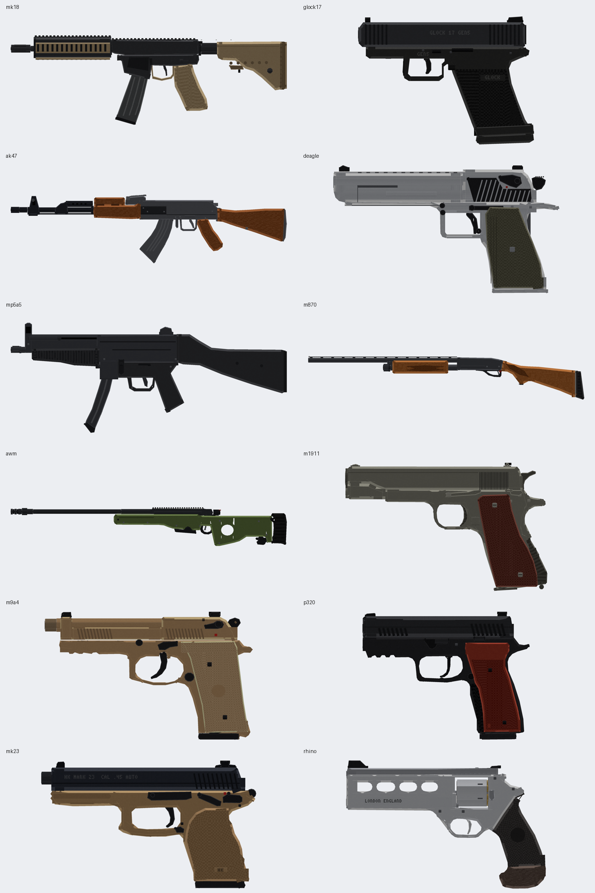

# modelsguns — модели оружия для мода на Fabric (GeckoLib)

Детализированные 3D-модели оружия для Minecraft **26.2 + Fabric + GeckoLib 5**:
геометрия Bedrock (`.geo.json`) с костями под анимации, анимации, текстуры и
определения предметов. Плюс проекты Blockbench для ручной доработки.



| Ствол | id | Кубов | Подвижные кости | Анимации |
|---|---|---|---|---|
| MK18 Mod 1 | `mk18` | 511 | bolt, charging_handle, trigger, dust_cover, magazine, bolt_catch, mag_release, selector | см. ниже |
| Glock 17 Gen 5 | `glock17` | 209 | slide, barrel, trigger, magazine, slide_stop, mag_catch | см. ниже |
| AK-47 Type 3 | `ak47` | 555 | bolt, trigger, selector, top_cover, magazine | см. ниже |
| Desert Eagle .50 AE | `deagle` | 276 | slide, hammer, trigger, magazine | см. ниже |
| H&K MP5A5 | `mp5a5` | 549 | cocking_handle, trigger, magazine | см. ниже |
| Remington 870 Wingmaster | `m870` | 276 | pump, trigger, shell | см. ниже |
| AI AWM .338 | `awm` | 406 | bolt, trigger, magazine | см. ниже |

Только само оружие: без прицелов, фонарей и прочего обвеса (у AWM — только
планка под оптику). AK-47, Desert Eagle, MP5, Remington 870 и AWM построены по
контурам с референсных фото (силуэты лежат в `tools/silhouettes/`, сами фото в
репозиторий не входят): контур каждой детали снят с фото в миллиметрах, ширина —
по реальным размерам. MP5 сделан как на фото — с постоянным прикладом (A2).

## Анимации и руки

У каждого ствола в модели есть **руки от первого лица** — кости `right_arm`
(правая рука на рукояти, указательный палец на спуске) и `left_arm` (левая на
цевье, у пистолетов — обхватывает правую). Перчатки и рукава, реальный размер.
Руки рисуются только от первого лица: `GunRenderer` из примера скрывает обе кости
в инвентаре, на земле и от третьего лица.

Все анимации — `animation.<id>.<имя>`, превью от первого лица (красный крестик —
центр экрана): `previews/anim/<id>_<имя>.gif`.

| Что | Имя | Цикл |
|---|---|---|
| 1. Покой | `idle` | да |
| 2. Выстрел от бедра | `shoot` (`shoot_last` — последний патрон, затвор на задержке) | |
| 3. Выстрел в прицеле | `aim_in` → `aim` (держать) → `shoot_aim` → `aim_out` | `aim` |
| 4. Перезарядка | `reload`, `reload_empty`; у Remington `reload_start` → `reload` (на каждый патрон) → `reload_end` | |
| 5. Холостой спуск (пусто) | `dry_fire`, `dry_fire_aim` | |
| 6. Бег (оружие поджато) | `sprint` | да |
| Ходьба | `walk` | да |
| Прочее | `draw`, `holster`, `inspect`, `idle_empty`; `firemode` (MK18, AK), `pump` (870), `bolt` (AWM) | |

- **Прицеливание:** смещение ствола в `aim` рассчитано из трансформа
  `firstperson_righthand` так, что линия прицеливания (верх целика/планки)
  встаёт в центр экрана. Если поменяете `display` в `models/item/<id>.json`,
  пересоберите (`python3 tools/build.py <id>`).
- **Руки в анимациях:** при перезарядке левая рука берёт магазин, уносит его и
  приносит новый; у Remington левая рука двигает цевьё и досылает патроны в
  окно; у AWM правая рука работает затвором.
- Две кости-контроллера в примере: `state` (idle / walk / sprint / aim,
  выбирается на клиенте) и `action` (все одноразовые анимации через
  `triggerAnim`). Переходы между циклами сглаживаются (5 тиков).

## Что внутри

```
geckolib/assets/modelsguns/             -> скопировать в src/main/resources/assets/<modid>/
  geckolib/models/item/<id>.geo.json       геометрия (Bedrock 1.12.0), кости = группы
  geckolib/animations/item/<id>.animation.json
  textures/item/<id>.png
  models/item/<id>.json                    базовая модель: положение в руке / GUI / рамке
  items/<id>.json                          minecraft:special -> geckolib:geckolib
geckolib/example/                       пример кода (Fabric 26.2, Mojang-имена, GeckoLib 5)
blockbench/<id>.bbmodel                 проекты Blockbench (формат Bedrock Model, текстура встроена)
previews/                               рендеры с разных сторон
tools/                                  генератор моделей на Python
```

## Подключение к моду

1. Подключите GeckoLib 5 для 26.2 (Fabric) как зависимость мода.
2. Скопируйте `geckolib/assets/modelsguns/*` в `src/main/resources/assets/<ваш_modid>/`.
   Файлы не ссылаются на namespace, кроме `items/*.json` и `models/item/*.json`
   (там `modelsguns:item/<id>`) — замените `modelsguns` на свой modid.
3. Зарегистрируйте предметы, как в `geckolib/example/`:
   - `GunItem` реализует `GeoItem`;
   - в `createGeoRenderer` отдаёт `GeoItemRenderer` с `DefaultedItemGeoModel`,
     который сам найдёт `geckolib/models/item/<id>.geo.json`,
     `geckolib/animations/item/<id>.animation.json` и `textures/item/<id>.png`;
   - предмет регистрируется с `Item.Properties().setId(key)`.
4. Анимации запускаются по имени `animation.<id>.<имя>`, например
   `triggerAnim(player, GeoItem.getOrAssignId(stack, serverLevel), "main", "shoot")`.

Пути, формат UV, порядок поворотов и знаки анимаций сверены с исходниками
GeckoLib (ветка `26.2`). В игре модели и пример кода не запускались — это шаблон.

## Стиль и технические детали

- Наклонные детали (рукояти, приклады, изогнутые магазины, спуски) строятся в
  повёрнутых «системах координат», поэтому у них настоящие фаски под 45°, а
  изгибы магазинов плавные (цепочка сегментов с шагом 1.5–2.5°).
- Фаски на длинных рёбрах с бликами, восьмигранные «цилиндры», ровная
  «нарисованная» текстура: шлифованная сталь, дерево, клетчатый стиплинг,
  насечка на дереве, маркировка.
- Полностью скрытые внутри грани не текстурируются; у подвижных деталей грани
  оставлены, чтобы их было видно во время анимации.
- Из-за поворотов по нескольким осям модели больше не подходят для ванильных
  Java-моделей предметов — только GeckoLib/Bedrock.

## Пересборка / новые стволы

```
pip install pillow numpy opencv-python scipy
python3 tools/build.py              # все стволы
python3 tools/build.py ak47         # только один
python3 tools/animpreview.py ak47   # GIF-превью анимаций
python3 tools/silhouette.py <папка с фото>   # заново снять силуэты (нужны фото)
```

Каждый ствол — файл `tools/<id>.py` с функцией `build()`, `GRIP_POINT`, `DISPLAY`
и `ANIMATIONS` (ключевые кадры в пространстве модели), плюс строка в
`GUN_MODULES` в `tools/build.py`. Деталь — одна строка
`B("имя", x0, y0, z0, x1, y1, z1, материал, кость, узор)`; для скруглённых деталей
есть `bevel`, `cyl_z`, `cyl_x`, `ring_z`, `pin_x`, `teeth_z`, `rail_z`, а для
наклонных частей — `with m.frame(("x", угол, точка)):` и `m.chain(...)`.
